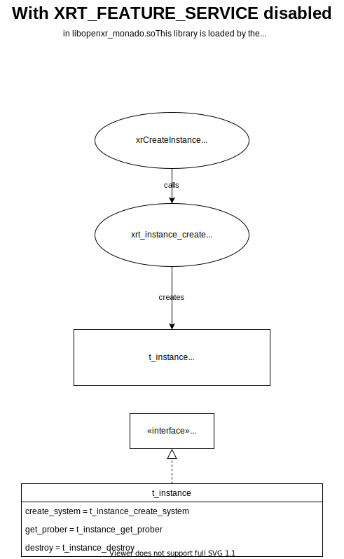
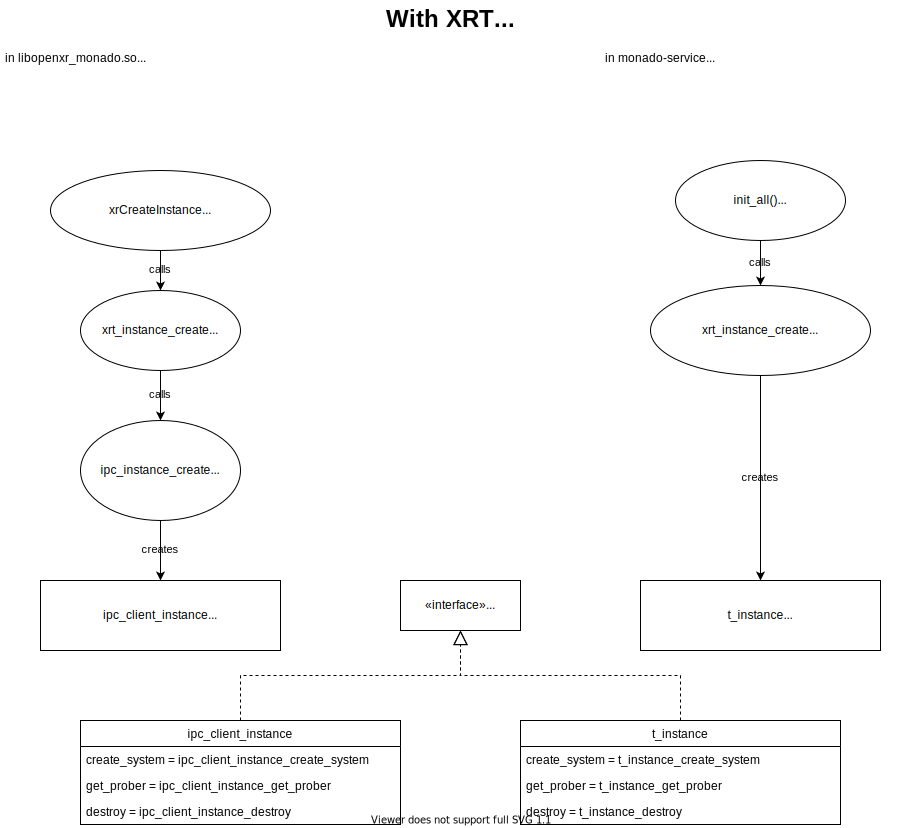

# Understanding and Writing Targets: Connecting the Pieces {#understanding-targets}

<!--
Copyright 2018-2020, Collabora, Ltd. and the Monado contributors
SPDX-License-Identifier: BSL-1.0
-->

Monado is designed to be a collection of related but independent modules. In a
sense, the Monado project is almost more of a "runtime construction kit" than a
single monolithic runtime. This makes it easy for adaptation and modification,
as well as extension, but it also means that any call in an OpenXR application
goes through quite a few modules before e.g. talking with the driver or the
compositor.

The final build product that brings all the desired
components together, potentially with additional code, is called the "target".
There are several targets included in the Monado source tree (in
`src/xrt/targets/`) including:

- `cli` - builds `monado-cli` executable
- `openxr` - builds `libopenxr-monado.so` OpenXR runtime shared object
- `gui` - builds `monado-gui` executable
- `service` - builds `monado-service` executable (if `XRT_FEATURE_SERVICE` is
  enabled)

There is also a directory `common` which builds two static libraries. Because
the "target" is responsible for pulling in all the desired drivers, etc. it can
lead to some repetition if multiple targets want the same driver collection. For
this reason, the "all drivers" code shared between many targets is located here,
though you could consider it a part of the individual targets. See this section
for details on how the targets find the drivers to probe: @ref writing-driver

## Requirements of a Target

A target must first provide the entry point desired: `int main()` if it's an
executable, or the well-known symbol name if it's a shared library. In some
cases, the entry point might be provided by one of the modules being combined to
form the target. For instance, an OpenXR runtime must expose
`xrNegotiateLoaderRuntimeInterface`: this function is provided by the OpenXR
state tracker `st_oxr`, so the OpenXR runtime target links the state tracker in
and ensures that symbol is present and visible in the final build product.

Then, the target must provide an interface to the collection of devices desired.
This is done by implementing the `xrt_instance` interface in your target and
providing a definition of `xrt_instance_create` that instantiates your
implementation.

All methods of `xrt_instance` are required, though the `get_prober` method may
output a null pointer if the instance is not using a prober, and targets that do
not need compositing may stub out the `create_native_compositor` method to
always return an error. A fully-featured implementation is in
`src/targets/common/target_instance.c`, which calls
`xrt_prober_create_with_lists` passing the common `target_lists` variable to
include all supported devices.

For more detailed information on this interface, see the documentation for @ref
xrt_instance.

## Sample Call Trees

For clarity, call trees are included below for the OpenXR runtime in two general
cases: `XRT_FEATURE_SERVICE` disabled, and `XRT_FEATURE_SERVICE` enabled.

Note that even with `XRT_FEATURE_SERVICE` enabled, the other targets (cli, gui)
more closely resembler the `XRT_FEATURE_SERVICE` disabled diagram: they contain
the device drivers internally rather than contacting the service. They use a
modified version of the in-process target instance without compositor support.

### XRT_FEATURE_SERVICE disabled

This is the simplest architecture. It is also the architecture used by the
various extra targets like `monado-cli` even when building with
`XRT_FEATURE_SERVICE` enabled. (The CLI and GUI link against a slightly modified
version, `target_instance_no_comp`, which stubs out the compositor creation
call, but are otherwise the same.)

### XRT_FEATURE_SERVICE enabled

Note that in this case, there are two processes involved, which have different
`xrt_instance` implementations.

- The runtime has a "stub" or "client proxy" implementation that delegates to
  the service over the IPC.
- The service has a normal or complete instance implementation that actually
  provides hardware device interaction, etc.

